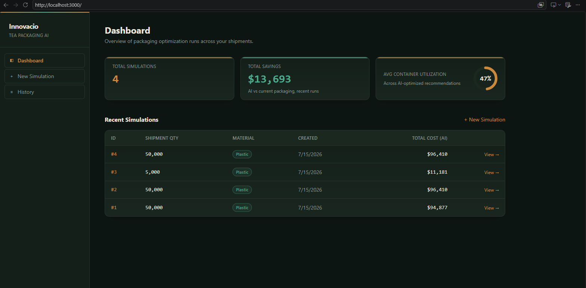
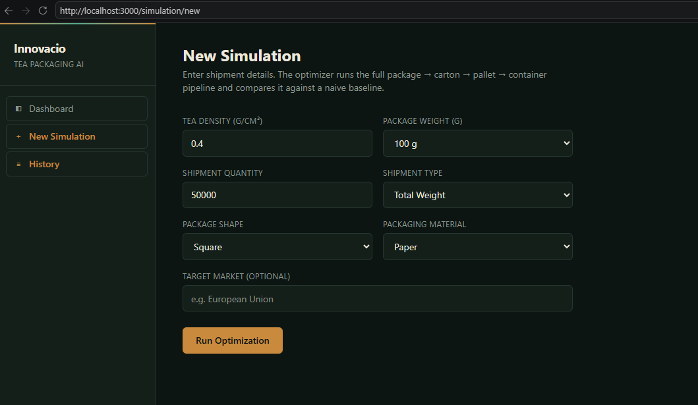
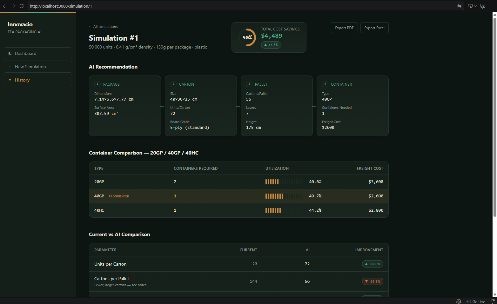
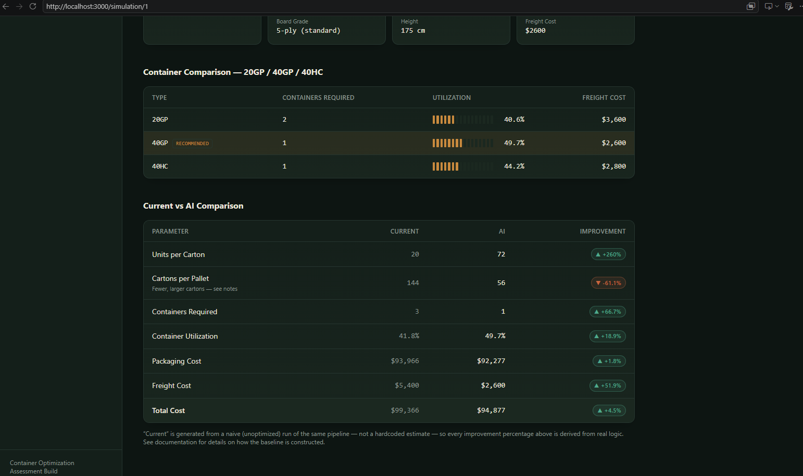

# Tea Packaging Optimization Platform

An AI-assisted system that recommends optimal packaging, carton, pallet, and
container configurations for tea exports — built for the Innovacio
Technologies AI Developer Assessment.

Given **tea density**, **package weight**, and **shipment quantity**, the
system calculates an optimized packaging pipeline (package → carton → pallet
→ container) and compares it against a naive "current practice" baseline to
quantify savings in material, space, and freight cost.

## Demo Video

[Watch the demo video](https://drive.google.com/drive/folders/1TCdHvA07yAb5YimpAhWL4DmjahN4x8AI?usp=sharing) — architecture, AI/optimization logic, and a live walkthrough of the application.

## Screenshots

| Dashboard | New Simulation |
|---|---|
|  |  |

| Results — Pipeline & Savings | Results — Current vs AI Comparison |
|---|---|
|  |  |

## Tech Stack

- **Backend:** Python, FastAPI, SQLAlchemy, SQLite (local dev)
- **Frontend:** Next.js (App Router), React, TypeScript, Tailwind CSS
- **Optimization:** Rule-based / mathematical optimization (no ML — see [AI Logic](#ai-logic))

## Setup Instructions

### Backend

```bash
cd backend
python -m venv venv
venv\Scripts\activate        # on macOS/Linux: source venv/bin/activate
pip install -r requirements.txt
uvicorn app.main:app
```

- API: http://127.0.0.1:8000
- Swagger docs: http://127.0.0.1:8000/docs
- A local SQLite file (`tea_packaging.db`) is created automatically on first run.

> **Windows note:** run without `--reload`. Uvicorn's `--reload` watcher
> failed to spawn its worker process reliably in this environment (Git Bash /
> PowerShell on Windows) — the reloader process would start and then hang
> with no server actually listening. Plain `uvicorn app.main:app` starts
> correctly every time. If you need autoreload on Windows, try running it
> from a native `cmd.exe`/PowerShell prompt instead of Git Bash.

### Frontend

```bash
cd frontend
npm install
npm run dev
```

- App: http://localhost:3000

### Docker (alternative to the above)

```bash
docker compose up --build
```

- Backend: http://localhost:8000
- Frontend: http://localhost:3000

This builds both services from their `Dockerfile`s and wires them together.
SQLite data persists in a named volume (`backend_data`) across restarts. To
use PostgreSQL instead, set `DATABASE_URL` on the `backend` service in
`docker-compose.yml` (the backend already reads it from the environment —
no code changes needed).

### Try it

1. Open http://localhost:3000 — empty Dashboard on first run.
2. Click **New Simulation**, fill in the form (defaults are pre-filled), submit.
3. You're redirected to the Results page: AI recommendation, container
   comparison, and current-vs-AI comparison.
4. Return to the Dashboard — it now shows real totals from your simulation(s).

## Architecture

```
User → Next.js frontend → FastAPI backend → Optimization services → SQLite
                                                                    (Simulation + Result tables)
```

The backend follows a strict separation of concerns:

- **`app/main.py`** — HTTP layer only. Validates requests (via `schemas.py`),
  calls the relevant service function, persists via SQLAlchemy if needed,
  returns a response. Contains no optimization logic itself.
- **`app/services/`** — pure Python optimization logic, framework-agnostic.
  Each module takes plain inputs and returns plain dataclasses — no FastAPI,
  no database, no HTTP. This means the optimization logic can be unit-tested
  or reused (e.g. in a batch job) without ever starting a web server.
- **`app/models/models.py`** — SQLAlchemy ORM table definitions.
- **`app/schemas.py`** — Pydantic request/response schemas (validation layer).
- **`app/database.py`** — DB engine/session setup + `get_db()` dependency.

The frontend is a thin client: it calls the backend's REST API (`lib/api.ts`)
and renders the results. No optimization logic lives in the frontend.

## Folder Structure

```
tea-packaging-ai/
├── backend/
│   ├── app/
│   │   ├── main.py                    # FastAPI app + all route handlers
│   │   ├── database.py                # DB engine, session, get_db()
│   │   ├── schemas.py                 # Pydantic request/response models
│   │   ├── models/
│   │   │   └── models.py              # SQLAlchemy tables (User, Simulation, Result, PackagingMaterial)
│   │   └── services/
│   │       ├── package_optimizer.py   # Module 3 — package dimensions/fill ratio
│   │       ├── carton_optimizer.py    # Module 4 — carton fitting
│   │       ├── pallet_optimizer.py    # Module 5 — pallet layout
│   │       ├── container_optimizer.py # Module 6 — 20GP/40GP/40HC comparison
│   │       └── cost_calculator.py     # Module 7 — current-vs-AI cost comparison
│   └── requirements.txt
└── frontend/
    ├── app/
    │   ├── page.tsx                   # Dashboard
    │   └── simulation/
    │       ├── page.tsx               # History / list of simulations
    │       ├── new/page.tsx           # New Simulation form
    │       └── [id]/page.tsx          # Results + Current vs AI comparison
    ├── components/                    # StatCard, UtilizationBar, etc.
    └── lib/api.ts                     # Typed fetch wrappers to the backend
```

## AI Logic

The optimization pipeline is a deterministic cascade, run twice per
simulation (once with naive/"current" assumptions, once with the optimizer),
so the two runs can be compared directly:

```
Tea Density + Package Weight
        ↓
Calculate Product Volume  (weight ÷ density)
        ↓
Generate Package Options   (square vs round, multiple fill-ratio candidates)
        ↓
Optimize Carton            (best packing of chosen package into standard carton grades)
        ↓
Optimize Pallet            (carton layout on a EURO pallet: layers × cartons/layer)
        ↓
Optimize Container         (evaluate 20GP / 40GP / 40HC, pick lowest freight cost per unit)
        ↓
Compare Current vs AI      (packaging cost, freight cost, utilization, total cost, % improvement)
```

This is **rule-based / mathematical optimization**, not machine learning —
each step uses closed-form geometry (volume, fill ratio, bin-packing-style
layer counts) and a small set of candidate configurations that are scored and
compared, then the lowest-total-cost option is recommended. No ML model is
used or required by the assessment brief.

Endpoints exist to run the pipeline in full (`POST /simulation`) or stop at
any intermediate stage (`POST /optimize/package|carton|pallet|container`) for
inspection or a "preview" UI flow.

## API Documentation

Full interactive docs (Swagger/OpenAPI) are auto-generated by FastAPI at
`/docs` when the backend is running. Summary of endpoints:

| Method | Path | Purpose |
|---|---|---|
| `GET` | `/` | Health check |
| `POST` | `/simulation` | Run the full pipeline, save input + output, return the saved simulation |
| `GET` | `/simulation` | List recent simulations (paginated via `skip`/`limit`) |
| `GET` | `/simulation/{id}` | Fetch one simulation with its full result (AI + current + comparison) |
| `POST` | `/compare` | Run current-vs-AI comparison without persisting (preview) |
| `POST` | `/optimize/package` | Run package optimization only |
| `POST` | `/optimize/carton` | Run package → carton |
| `POST` | `/optimize/pallet` | Run package → carton → pallet |
| `POST` | `/optimize/container` | Run the full cascade, return all container-type comparisons |

## Database Schema

Tables: `users`, `packaging_materials`, `simulations`, `results`.
Full ER diagram, column reference, and JSON field shapes:
[`docs/database-schema.md`](docs/database-schema.md).

**Assumption / design decision:** the assessment brief lists separate tables
for Tea Density, Package Types, Cartons, Pallets, and Containers. This
project uses a **hybrid schema** instead:

- `users`, `simulations`, and `packaging_materials` are real tables — they
  have independent identity and are queried directly (e.g. "all simulations
  for this user", or looking up material cost by name).
- Per-simulation package/carton/pallet/container results are stored as
  **JSON columns on a single `results` table** (one-to-one with
  `simulations`), rather than four normalized tables joined by foreign keys.

Rationale: each simulation run produces exactly one package/carton/pallet/
container configuration each for "current" and "AI" — these are never
queried independently of their parent simulation, never shared across
simulations, and never updated after creation. Full normalization would add
join complexity for no real query benefit. This is documented here as an
explicit, deliberate trade-off rather than an oversight.

## Other Assumptions

- No authentication is implemented; `user_id` on `Simulation` is nullable to
  support anonymous/demo use. Auth was scoped as a bonus feature in the brief.
- Pallet type is fixed to EURO pallet dimensions; container types compared
  are the three specified in the brief (20GP, 40GP, 40HC).
- SQLite is used for local development (per the brief, "any relational
  database" is acceptable); swapping to PostgreSQL only requires changing
  the connection string in `app/database.py`.
- CORS is fully open (`allow_origins=["*"]`) for local development
  convenience; this should be restricted to the actual frontend origin
  before any real deployment.

## Known Gaps / Not Yet Done

In the interest of an accurate submission:

- No automated test suite yet.
- No CI/CD pipeline.
- No 3D container visualization, PDF/Excel export, or AI chat assistant
  (all listed as bonus features in the brief).
