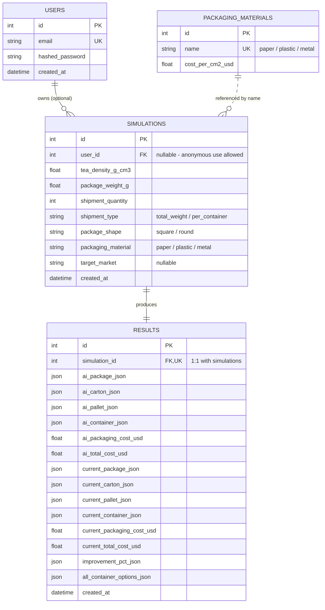

# Database Schema

This document is the standalone schema deliverable requested by the assessment's
Submission Checklist. It reflects exactly what is defined in
[`backend/app/models/models.py`](../backend/app/models/models.py) — no
aspirational tables, only what actually exists and runs.

## Design decision: hybrid normalization, not full 9-table normalization

The assessment PDF names 9 conceptual entities: Users, Simulations, Tea Density,
Packaging Materials, Package Types, Cartons, Pallets, Containers, Results.

We implement **4 real tables** and fold the remaining 5 into JSON columns on
`results`:

| PDF entity | Implementation |
|---|---|
| Users | real table (`users`) |
| Simulations | real table (`simulations`) |
| Packaging Materials | real table (`packaging_materials`) |
| Results | real table (`results`) |
| Tea Density | input field on `simulations` (not a lookup table — see below) |
| Package Types, Cartons, Pallets, Containers | JSON columns on `results` |

**Why:** a table earns a real, separate row-per-record identity when it is
(a) shared across simulations, (b) queried independently of its parent, or
(c) updated after creation. `PackagingMaterial` meets that bar — it's shared
reference data an admin could edit. A simulation's package/carton/pallet/
container configuration meets none of it: each simulation produces exactly
one of each, they're never queried on their own, never shared between runs,
and never mutated after the simulation completes. Normalizing them into 4
extra tables with foreign keys would add JOIN overhead for zero query benefit
— a textbook case for storing them as a JSON document instead ("denormalize
for read/write patterns"). This mirrors how the PDF's own `Result` /
Module 7 comparison table is naturally a single document (current config +
AI config + improvement %), not a set of rows to join back together.

`Tea Density` isn't a lookup table because the PDF's own field-type table
specifies it as a free-form `Number` input, not a dropdown — there's no
finite catalog of "tea densities" to store rows for; it's simulation-specific
input data, so it lives as a column on `simulations`.

## Entity-relationship diagram

`packaging_materials.name` is a soft/logical reference, not a SQL foreign
key — `simulations.packaging_material` stores the string value directly
(e.g. `"paper"`) rather than an FK id, since the material list is small and
fixed and the API contract already speaks in these string enums.

## Table reference

### `users`
| Column | Type | Notes |
|---|---|---|
| id | int, PK | |
| email | string, unique, indexed | |
| hashed_password | string | bonus-feature auth, not currently wired to routes |
| created_at | datetime | |

### `packaging_materials`
| Column | Type | Notes |
|---|---|---|
| id | int, PK | |
| name | string, unique | `paper`, `plastic`, `metal` |
| cost_per_cm2_usd | float | |

### `simulations`
Module 2 (New Optimization) form input, one row per run.

| Column | Type | Notes |
|---|---|---|
| id | int, PK | |
| user_id | int, FK → users.id, nullable | anonymous/demo use allowed |
| tea_density_g_cm3 | float | |
| package_weight_g | float | |
| shipment_quantity | int | |
| shipment_type | string | `total_weight` \| `per_container` |
| package_shape | string | `square` \| `round` |
| packaging_material | string | `paper` \| `plastic` \| `metal` |
| target_market | string, nullable | optional per PDF |
| created_at | datetime | |

### `results`
Modules 3–7 output, one row per simulation (1:1).

| Column | Type | Shape |
|---|---|---|
| id | int, PK | |
| simulation_id | int, FK → simulations.id, unique | |
| ai_package_json | JSON | `{length_cm, width_cm, height_cm, volume_cm3, surface_area_cm2, aspect_ratio}` |
| ai_carton_json | JSON | `{carton_length_cm, carton_width_cm, carton_height_cm, units_per_carton, fill_ratio, carton_weight_kg, board_grade}` |
| ai_pallet_json | JSON | `{pallet_type, cartons_per_layer, layers, cartons_per_pallet, pallet_height_cm, total_weight_kg}` |
| ai_container_json | JSON | `{container_type, pallets_per_container, containers_required, total_units_shipped, container_utilization, empty_space_pct, freight_cost_usd}` |
| ai_packaging_cost_usd | float | |
| ai_total_cost_usd | float | |
| current_package_json ... current_total_cost_usd | JSON / float | same shapes as the `ai_*` columns, for the naive baseline |
| improvement_pct_json | JSON | `{package_size, carton_size, units_per_carton, cartons_per_pallet, containers_required, packaging_cost, freight_cost, container_utilization, total_cost}` — Module 7 |
| all_container_options_json | JSON | array of `ContainerResult`-shaped objects, one per `20GP` / `40GP` / `40HC` — Module 6 |
| created_at | datetime | |

## Known limitation

Tables are created via SQLAlchemy's `Base.metadata.create_all()` on
application startup (`backend/app/main.py`), not via versioned migrations.
There is no Alembic migration history — acceptable for a 1-day assessment
build, but the first thing to add before any real schema change in
production.
